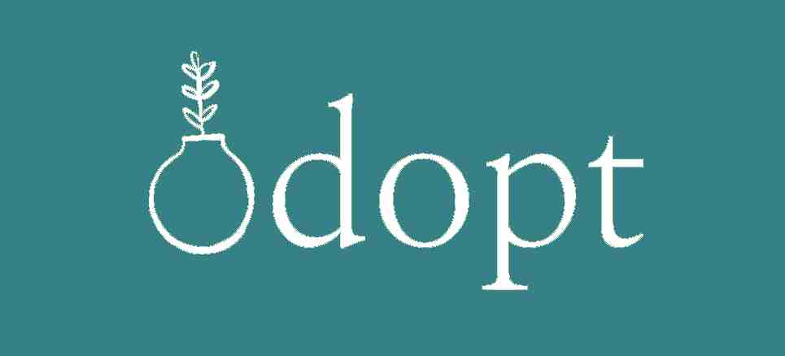
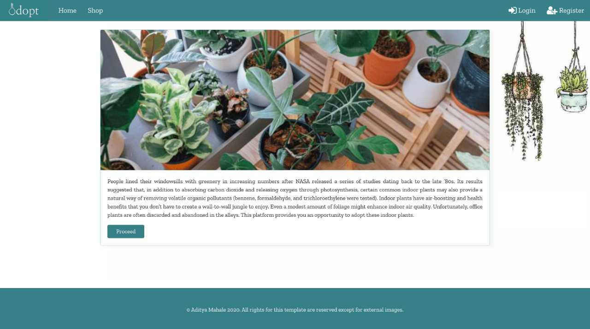
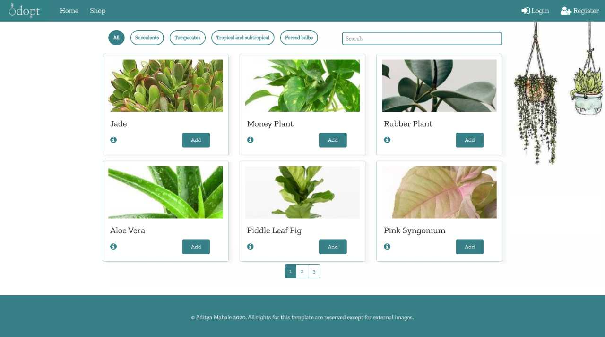
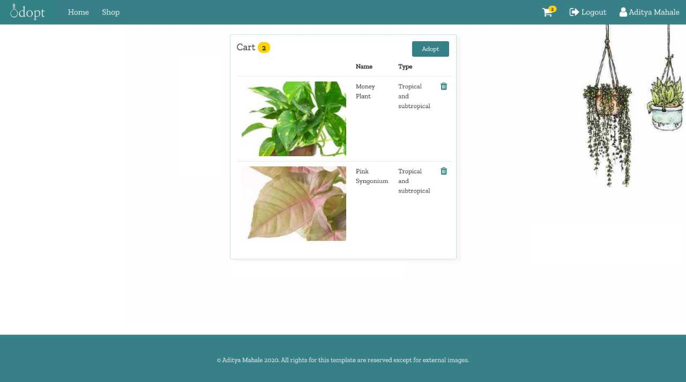

Taking inspiration from a podcast, I have created a website for the adoption of indoor plants. I have developed the website using React.js and Bootstrap for the front-end and Node.js/Express.js and MongoDB for the back-end.

#Features:

1. The website lists down different types of plants in the form of a card with images.
2. Provides feature to filter plants based on their type.
3. The shop page provides a search box to search plants by their name.
4. Users will be able to add plants to a cart.
5. Info link on the card to show a modal with plant specific information.
6. Authentication and Authorization.
7. Encryption of user password.
8. POST user cart payload.
9. User details page listing down adoption history.

